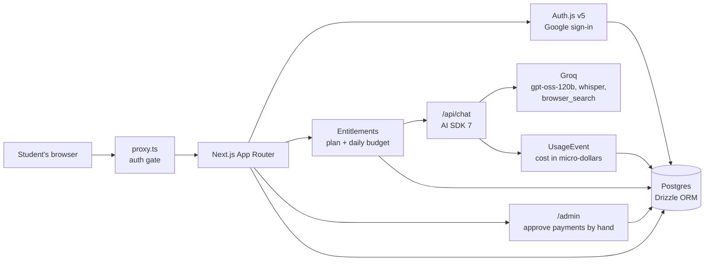

# Able

**Ask Able anything. A fast AI assistant for students.**

Able is a paid, ChatGPT-style assistant for students. You sign in with Google,
pick a plan, pay by UPI, and chat: streaming answers, reasoning you can expand,
web search, file uploads, voice input and memory. There is no free tier and no
payment company. The owner approves each payment by hand from an admin page.

The product and build spec lives in [`docs/SPEC.md`](docs/SPEC.md) and is the
source of truth for every decision in this repository.

## Features

- **Chat** with streaming answers, stop, regenerate, and edit-and-resend.
- **History** you can search, rename and delete, grouped into project folders.
- **Projects**: folders with their own instructions, applied to every chat inside.
  Open Projects, select a project, then open its folder to browse the existing
  conversations and return to the same chat interface. Folder counts and lists
  use the existing database relationship and check ownership on the server.
- **Markdown, code blocks and maths**, plus a collapsible view of the model's
  reasoning.
- **Web search** as a composer toggle, so the model only gets the search tool
  when you ask for it.
- **File uploads**: PDF, DOCX, TXT, MD and CSV up to 10 MB, stored as extracted
  text.
- **Voice input**: record up to 60 seconds and have it transcribed into the
  composer.
- **Memory and custom instructions**, both switchable and editable from settings.
- **Plans, paywall and refunds**: UPI payment with a generated QR code, manual
  approval, a 7-day money-back window, and a renewal reminder email.
- **Admin page** for the owner: payment queue, subscriptions, refund requests,
  user search, and today's and the last 30 days' AI cost.
- **Dark mode** and a phone-friendly layout.

### Plans

| Plan  | Price (30 days) | Reasoning effort | Daily messages | Project folders |
| ----- | --------------- | ---------------- | -------------- | --------------- |
| Basic | ₹250            | `low`            | 40             | 3               |
| Plus  | ₹800            | `medium`         | 100            | 20              |
| Pro   | ₹1,200          | `high`           | Unlimited\*    | Unlimited       |

\* Pro is shown as unlimited and enforces a hidden fair-use ceiling.

Daily allowances are not a plain message count. Every response records its real
cost in micro-dollars, from input, cached input, output and reasoning tokens
plus web searches and transcribed audio, and that cost is subtracted from a
daily budget. A cheap question costs less of your day than an expensive one.

## Tech stack

- [Next.js 16](https://nextjs.org) App Router with `proxy.ts`, React 19
- [AI SDK 7](https://ai-sdk.dev) with [`@ai-sdk/groq`](https://ai-sdk.dev/providers/ai-sdk-providers/groq)
- [Groq](https://groq.com): `openai/gpt-oss-120b` for answers,
  `openai/gpt-oss-20b` for chat titles, `whisper-large-v3-turbo` for voice
- [Auth.js v5](https://authjs.dev) with Google as the only sign-in provider
- [Drizzle ORM](https://orm.drizzle.team) on Postgres ([Neon](https://neon.tech)
  in production, [`embedded-postgres`](https://www.npmjs.com/package/embedded-postgres)
  locally)
- [shadcn/ui](https://ui.shadcn.com) with [Tailwind CSS 4](https://tailwindcss.com)
- [Biome](https://biomejs.dev) through [ultracite](https://www.ultracite.ai),
  [Vitest](https://vitest.dev) for unit tests,
  [Playwright](https://playwright.dev) for end-to-end tests

## Architecture



Every request passes the auth gate, then the entitlement check: is there a
current subscription, and is there budget left today? Only then does the chat
route call Groq. Usage reported by the AI SDK is priced and written back after
each response, which is what the daily budget and the admin cost view read.

Directory map:

| Path           | What lives there                               |
| -------------- | ---------------------------------------------- |
| `app/(auth)`   | Sign-in and Auth.js configuration               |
| `app/(chat)`   | Chat UI and API routes                          |
| `app/(legal)`  | Terms, privacy, refunds and contact pages       |
| `components`   | UI components, built on shadcn/ui               |
| `lib/ai`       | Groq provider, prompts, tools and entitlements  |
| `lib/db`       | Drizzle schema, queries and migrations          |
| `docs/SPEC.md` | Product and build spec                          |

## Running locally

### Local v1: no Google authentication

After starting the local database and running migrations, use
`corepack pnpm dev:local` and open [localhost:3105](http://localhost:3105).
This version opens directly into a shared local workspace with a sample Plus
plan. It uses real Groq responses when `GROQ_API_KEY` is configured;
`corepack pnpm dev:live` requires a key and `corepack pnpm dev:preview` always
uses sample responses. Google credentials and a sign-in step are not needed.
Chats and settings stay in the local database. The preview command binds to
the local computer; the no-login mode is disabled in production builds.
Payments use `UPI_ID` and `UPI_PAYEE_NAME` from `.env.local`, including the
local workspace. Every plan generates its QR code and payment link for that
account and its own price. Local payment settings take effect without a server
restart. Payment approval remains manual.

### Connected setup

There is no Docker or system Postgres requirement: `embedded-postgres` runs a
real Postgres on port 5433 with its data in `.localdb/`.

```bash
corepack pnpm install
corepack pnpm db:local          # start the local Postgres
cp .env.example .env.local      # then fill in the values below
corepack pnpm db:migrate
corepack pnpm dev
```

Able is then on [localhost:3000](http://localhost:3000).

> `corepack pnpm build` runs the database migrations before building, so it
> needs a reachable `POSTGRES_URL`.

## Tests and checks

```bash
corepack pnpm test:unit         # vitest: plans, metering, entitlements, refunds
corepack pnpm test:db           # unit tests plus isolated database integration
corepack pnpm test              # playwright end-to-end, with mock models
corepack pnpm check             # biome through ultracite
corepack pnpm exec tsc --noEmit # types
node scripts/test.mjs build     # production build with isolated test database
```

Tests never call Groq, Google or Resend. The end-to-end suite uses the
template's mock models and a test-only credentials provider.

`test:db` creates and migrates the local `able_test` database. Browser tests
use that database and a separate app on port 3106, leaving the local workspace
on port 3105 running. Set `TEST_POSTGRES_URL` to override the local database
(its name must end in `_test`). Test runs clear live AI and email credentials.
CI starts its own PostgreSQL service.

## Environment

`.env.example` lists every variable. `.env.local` is never committed.

| Variable                               | Purpose                                     |
| -------------------------------------- | ------------------------------------------- |
| `AUTH_SECRET`                          | Auth.js secret                              |
| `AUTH_GOOGLE_ID`, `AUTH_GOOGLE_SECRET` | Google OAuth client                         |
| `GROQ_API_KEY`                         | Groq                                        |
| `POSTGRES_URL`                         | Postgres; Neon in production                |
| `ADMIN_EMAILS`                         | Comma-separated admin Google emails         |
| `UPI_ID`, `UPI_PAYEE_NAME`             | Payment QR details                          |
| `SUPPORT_EMAIL`                        | Shown on the pricing and contact pages      |
| `CRON_SECRET`                          | Protects the reminder cron                  |
| `NEXT_PUBLIC_APP_URL`                  | Absolute links in emails and social cards   |
| `RESEND_API_KEY`, `EMAIL_FROM`         | Optional email                              |
| `REDIS_URL`                            | Optional: rate limits and resumable streams |

## Deployment

Able deploys to [Vercel](https://vercel.com) as a standard Next.js app.

1. **Neon**: create a database and copy the pooled connection string into
   `POSTGRES_URL`.
2. **Google Cloud**: create a web OAuth client. Add the redirect URIs
   `http://localhost:3000/api/auth/callback/google` and
   `https://<your-domain>/api/auth/callback/google`, and point the consent
   screen at `https://<your-domain>/privacy`.
3. **Groq**: create an API key. The base limits only serve a few dozen
   reasoning messages a day for the whole app, so ask Groq for higher limits
   before opening sign-ups.
4. **Vercel**: set every variable above in the project, then deploy. The daily
   reminder cron calls `/api/cron/reminders` and is protected by `CRON_SECRET`.

## Legal

`/terms`, `/privacy`, `/refunds` and `/contact` ship with the app and are linked
from sign-in, pricing and settings. They are drafts awaiting the owner's review;
the bracketed placeholders in them are filled in before launch.

## Credits

Able is built on [vercel/ai-chatbot](https://github.com/vercel/ai-chatbot),
licensed under Apache-2.0. The upstream licence is kept at
[`LICENSE`](LICENSE), the modifications are recorded in [`NOTICE`](NOTICE), and
the exact upstream commit is noted in [`docs/UPSTREAM.md`](docs/UPSTREAM.md).
